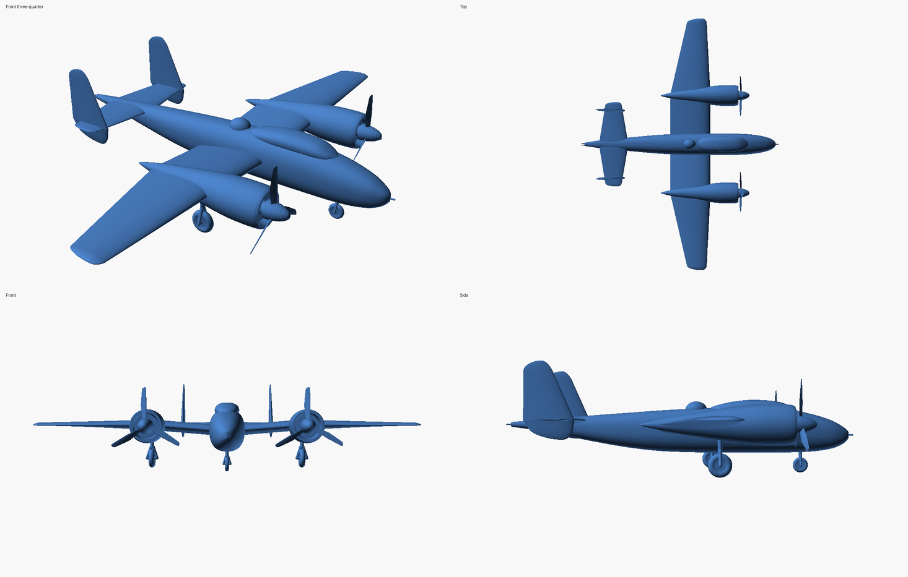

# B-25 Mitchell – parametric OpenSCAD model generator

An [OpenSCAD](https://openscad.org) program that builds a North American **B-25 Mitchell** (B-25H/J) and
exports it as an **STL**. The **wing is fully parametric** – span, chords, sweep, dihedral, incidence,
twist and the **airfoil at the root and at the tip** – and every default is the real B-25 value, so the
untouched script gives you the aircraft as built. The fuselage, H-tail, engine nacelles, propellers and
tricycle landing gear are included too (stylised from the three-view proportions, also adjustable).



## Quick start

**GUI** – open `b25_mitchell.scad` in OpenSCAD, open *Window ▸ Customizer*, change the parameters
(pick the root and tip airfoils from the drop-downs, or type any NACA code), press **F6** (render) and
choose *File ▸ Export ▸ Export as STL*. The saved presets in `b25_mitchell.json` appear in the
Customizer's preset list.

**Command line**

```bash
openscad -o b25.stl b25_mitchell.scad                                    # the B-25J as built, 1:72
scripts/export_stl.sh b25.stl                                            # same, as a (smaller) binary STL

# change the wing: airfoils, span, sweep, dihedral, washout ...
scripts/export_stl.sh b25.stl -D 'root_airfoil="2412"' -D 'tip_airfoil="0009"'
scripts/export_stl.sh b25.stl -D 'root_airfoil_override="23112"' -D wing_span_m=18 -D tip_twist_deg=-1
scripts/export_stl.sh b25.stl -D le_sweep_outboard_deg=12 -D dihedral_outer_deg=3 -D scale_denominator=100

# only the wing / airfoil plates / a quick draft
scripts/export_stl.sh wing.stl -D 'part="wing_only"'
scripts/export_stl.sh plates.stl -D 'part="airfoil_preview"'
scripts/export_stl.sh draft.stl -D 'quality="draft"'

# saved parameter sets
scripts/export_stl.sh b25.stl -p b25_mitchell.json -P "Long span - 24 m, NACA 23015 to 4412"
```

The default `high` quality takes about 7 minutes to render on OpenSCAD 2021.01 and about 11 seconds with the
Manifold back end of newer versions (see [Render time](#render-time)); use `quality="draft"` for a quick look.

The console prints a wing report, for example
`B-25 wing: span 20.6 m, area 56.7 m^2 (B-25J: 56.7), aspect ratio 7.49, taper 0.46, MAC 2.88 m`, and warns
when your changes move the wing area more than 5 % away from the real aircraft.

Developed and tested with **OpenSCAD 2021.01** (Ubuntu's package) and **2025.01.19**; it needs 2019.05 or newer
(`assert`, `each`, `is_string`).

## Conventions

* The model is built in metres on the full-size aircraft and scaled to **millimetres** at the end:
  `scale_denominator = 72` gives a 1:72 model (286 mm span, 224 mm long); `1` gives full size in mm.
* **Nose = +X**, starboard wing = +Y, up = +Z. The origin is the wing-root quarter-chord point on the
  fuselage reference line.
* `quality` = `draft` / `normal` / `high` (default **high**). See [Render time](#render-time).

## Wing parameters

All lengths in metres on the full-size aircraft. Defaults are the B-25H/J values; the *source* column says
how solid each number is (see [Data and confidence](#data-and-confidence)).

| Parameter | Default | Meaning | Source |
|---|---|---|---|
| `root_airfoil` / `root_airfoil_override` | `23017` | airfoil on the centreline (drop-down, or any NACA code typed in the override) | published |
| `tip_airfoil` / `tip_airfoil_override` | `4409` | airfoil at the tip | published |
| `airfoil_blend_start` | `-1` | semi-span fraction where root→tip airfoil morphing starts (`-1` = end of centre section) | assumed |
| `root_thickness_scale`, `tip_thickness_scale` | `1`, `1` | thickness multipliers (1 = true NACA thickness) | – |
| `trailing_edge_thickness` | `0` | extra blunt trailing edge as a fraction of chord (≈ 0.004 helps small prints) | – |
| `wing_span_m` | `20.60` | total span (67 ft 7 in) | published |
| `center_halfspan_m` | `3.99` | half-span of the constant-chord centre section: nacelle station and dihedral break (157 in) | published |
| `root_chord_m`, `kink_chord_m`, `tip_chord_m` | `3.30`, `3.30`, `1.51` | chords at the centreline, end of centre section, tip | **estimated** – sized so the area is 56.7 m² |
| `le_sweep_inboard_deg`, `le_sweep_outboard_deg` | `0`, `3` | sweep of the reference line on the centre section / outer panels | **estimated** |
| `sweep_ref_chord_fraction` | `0` | chord fraction the sweep refers to (`0` = leading edge, `0.25` = quarter chord) | – |
| `wing_tip_round_m` | `0.35` | length over which the tip is rounded (`0` = flat tip) | styling |
| `dihedral_center_deg` | `4.64` | centre-section dihedral (4°38′23″) | published |
| `dihedral_outer_deg` | `0.36` | outer-panel dihedral (0°21′39″) – with the line above this makes the B-25's **gull wing** | published |
| `root_incidence_deg` | `2.0` | root incidence | moderate confidence |
| `tip_twist_deg` | `-2.49` | tip incidence relative to the root, linear (washout, 2°29′37″) | published |
| `wing_le_station_m`, `wing_z_m` | `5.60`, `0.05` | position of the root leading edge: station from the nose and height above the fuselage line | **estimated** |

### Airfoil selection

* Any **NACA 4-digit** code (`2412`, `4409`, `0012` …) and any **NACA 5-digit** code with a standard
  (`210`–`250`) or reflex (`221`–`251`) camber line (`23017`, `23012`, `23112` …) – pick one from the
  drop-down or type it into `root_airfoil_override` / `tip_airfoil_override`. Bad codes stop the build with
  *Unsupported airfoil code …*.
* **Custom airfoils**: set the drop-down to `custom` and fill `custom_root_airfoil` / `custom_tip_airfoil`
  (in the *Hidden* section of the script, or with `-D 'custom_root_airfoil=[[1,0],…]'`) with Selig-format
  points (trailing edge → upper surface → leading edge → lower surface → trailing edge, chord 1). They are
  normalised and resampled onto the same grid as the NACA sections so root and tip can always be blended.
* The section is blended linearly from the root airfoil to the tip airfoil between
  `airfoil_blend_start` and the tip; with the defaults the 17 %-thick 23017 section carries the nacelles and the
  morph to the 9 %-thick 4409 happens on the outer panels.
* `part="airfoil_preview"` exports the two selected airfoils as 100 mm plates so you can see them.

### Other parts

`fuselage_length_m`, `fuselage_width_scale`, `fuselage_height_scale`, `stab_*`, `fin_*`, `tail_root_airfoil`,
`tail_tip_airfoil`, `nacelle_y_m`, `nacelle_front_station_m`, `nacelle_diameter_scale`,
`propeller_diameter_m`, `propeller_blades` and the `show_*` switches (fuselage, canopy and turret, gun barrels,
tail, nacelles, propellers, landing gear) are all in the Customizer. Switch the landing gear off for a
wheels-up display or print model.

## Parameter sets

`b25_mitchell.json` holds saved sets: **B-25J default**, a straight no-gull wing with NACA 2412→0009, a
24 m long-span wing, a thin wing, and a swept wing. Apply one with `-p b25_mitchell.json -P "<name>"` or from
the Customizer. Save your own from the Customizer's `+` button.

## Render time

The airframe is a union of many lofted meshes, which OpenSCAD's CGAL back end evaluates slowly. Measured
with OpenSCAD 2021.01 on 4 cores (single-threaded CGAL):

| `quality` | triangles | OpenSCAD 2021.01 (CGAL) | peak memory |
|---|---|---|---|
| `draft` | ≈ 23 k | ≈ 40 s | < 1 GB |
| `normal` | ≈ 63 k | ≈ 2 min | ≈ 1 GB |
| `high` (default) | ≈ 176 k | ≈ 6 min 45 s | ≈ 3 GB |

With a newer OpenSCAD and the Manifold back end the same default `high` model took **about 11 seconds**
(OpenSCAD 2025.01.19: `openscad --backend=manifold -o b25.stl b25_mitchell.scad`, or *Preferences ▸ Features ▸
Manifold* in the GUI), and both engines produce the same solid (volumes agree to 7 parts per million).
`part="wing_only"` renders in about a second and F5 preview is instant at any quality.

## Data and confidence

**Published (used as given):** span 20.60 m, wing area 56.7 m² (610 sq ft), aspect ratio 7.49, length 16.13 m,
height 4.98 m (the default model, gear down, comes out at 4.94 m), propeller diameter 3.8 m, airfoils NACA 23017 (root) and NACA 4409 (tip), the gull-wing layout,
centre-section dihedral 4°38′23″, outer-panel dihedral 0°21′39″, washout 2°29′37″, and the 157 in length of
the centre section main spars.

**Estimated:** root/kink/tip chords, sweep, wing position, fuselage section table, tail surfaces, nacelle
and landing-gear shapes. The chords were chosen to reproduce the published wing area exactly (the report line
above shows 56.7 m²), but the planform itself is not taken from a drawing. Please check them against a
three-view drawing if you need survey-grade accuracy – every one is a parameter.

**Caveat on sources.** Several museum and encyclopedia pages could not be opened from the environment this was
written in, so the numbers come from search-result summaries of:
[Wikipedia – North American B-25 Mitchell](https://en.wikipedia.org/wiki/North_American_B-25_Mitchell)
(span, area, airfoils, gull wing),
[Delaware Aviation Museum – B-25J specifications](https://delawareaviationmuseum.org/b-25j-mithell-specifications)
(length, span, height, propellers),
the [Skytamer NA-100 B-25D page](https://www.skytamer.com/NA-100_B-25D.html) /
[Warbirds of Glory B-25J restoration notes](https://www.warbirdsofglory.org/design.asp) (dihedral, twist) and
[Nick Ziroli's 1/8-scale B-25 plans](https://ziroligiantscaleplans.com/plane-plans/b-25-mitchell-118-plan.html)
(root incidence, spar length). Treat the dihedral, twist and incidence values as "as reported" until
you have checked a primary source.

## Tests

```bash
tests/run_tests.sh            # everything (a few minutes)
tests/run_tests.sh --full     # + whole-aircraft builds at draft quality
```

* `tests/airfoil_tests.scad` – `assert()` unit tests: NACA thickness/camber against published values,
  reflex camber lines closing, code validation, custom-airfoil round trip, planform records, tip rounding,
  loft volume and closed-manifold topology.
* `tests/param_sweep.py` – builds STLs through the OpenSCAD CLI with many `-D` overrides (airfoils, span,
  chords, sweep, dihedral, incidence, twist, thickness, blending, scale, custom airfoils, presets) and compares
  spanwise cross-sections with an independent numpy model (`tests/naca_reference.py`); also checks that bad
  input is rejected with a clear message.
* `tests/validate_stl.py` – watertight, consistent winding, positive volume, no degenerate faces, and
  optional extent / area / thickness checks for any STL.

## Limitations

* The fuselage, tail, nacelles and gear are stylised, with no panel lines, windows, exhausts or control-surface
  gaps; flaps and ailerons are not modelled separately.
* Fine details become very small at 1:72 (tail guns ≈ 0.4 mm, prop blades ≈ 0.8 mm thick); use a smaller
  `scale_denominator` or `trailing_edge_thickness` for printing, or turn parts off with the `show_*` switches.
* OpenSCAD 2021.01 writes ASCII STL with 6 significant digits; the export script prefers binary STL.
